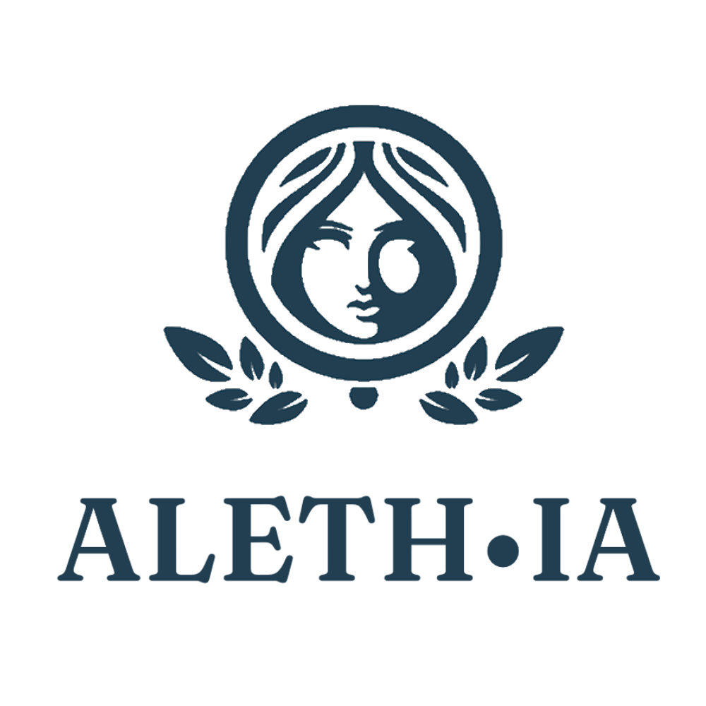

# team-9 Platanus Hack 26: Buenos Aires Project

**Current project logo:** project-logo.png

Track: 🛸 Future

team-9

- Cristian Arean ([@CristianArean](https://github.com/CristianArean))
- Francisco Juarez ([@franjuarez](https://github.com/franjuarez))
- Joaquin Hernandez ([@joaquin-her](https://github.com/joaquin-her))
- Valentin Schneider ([@Valen1611](https://github.com/Valen1611))
- Juan Martin De La Cruz ([@juandelaHD](https://github.com/juandelaHD))

Before Submitting:

- ✅ Set a project name and description in platanus-hack-project.json

- ✅ Provide a 1000x1000 png project logo, max 500kb

- ✅ Provide a concise and to the point readme.

Have fun! 🚀
